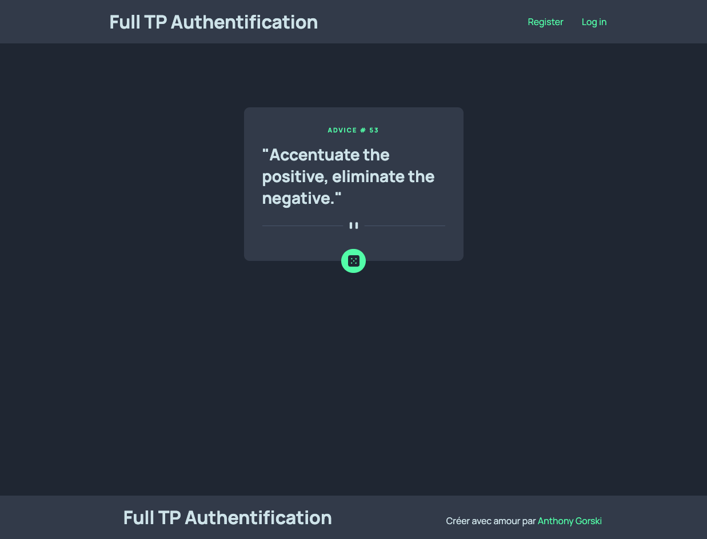

# Fullstack projet

## Frontend

Pour le frontend, j'ai pris celui de [frontend mentor](https://www.frontendmentor.io/challenges/advice-generator-app-QdUG-13db).
Nous allons rajouter une barre de navigation pour accéder un signup / login et mon compte. 

Nous pouvons aussi faire un bouton acceder à nos quotes like.

APi utilisée : https://api.adviceslip.com

## Backend

Pour le backend, ce sera un backend plutôt simple, nous allons quand même faire un petit MVC.

## Précision

Sur la branche `crm` nous avons le projet uniquement en frontend. Aucun lien avec un backend.

Sur la branche `backend_register` c'est les étapes que j'ai créer pour enregistrer un utilisateur.

Sur la branche `backend_login` c'est les étapes que j'ai créer pour login un utilisateur. il y a 2 versions, une simple, l'autre en ajoutant un token.

Ensuite, nous allons continuer avec la liaison entre le backend et le frontend.

